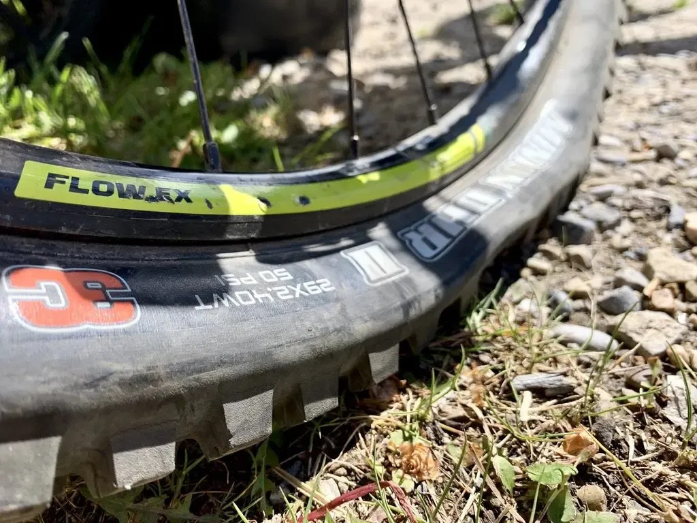
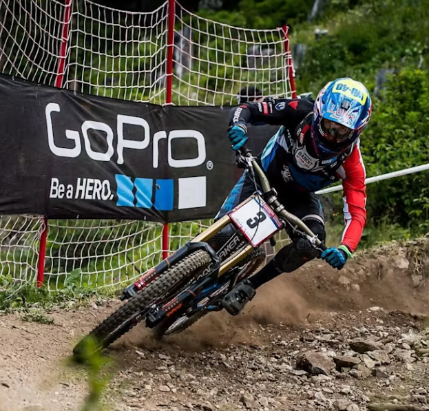

Tips

Como aprovechar mejor el frenado.

1. Bajar la presion de la llanta delantera  -20-23 psi- al tener muy inflada la llanta delantera se pierde la tracción y la llanta se va de largo.Una buena tracción  es necesaria, la trasera necesita mayor presión para aguantar las piedras y raices.

   

2. Los frenos son importantes : Magura mt7, frenos de 4 pistones, muy buena potencia de frenado, manetas hc3 muy regulables.Frenar con un dedo -indice- , hay mayor fuerza para agarrar el manubrio , tiene varios ajustes para dejarla comoda al usuario.

3. Técnica de frenado = buena seleccion de linea. Que hacer antes , durante y despues.,frenar antes de la curva y evitar derrapes que maltraten el terreno y con eso se mantiene una velocidad constante durante la curva.Bloquear la rueda trasera puede parecer muy agresivo pero, a la larga, te retrasa.

4. Frenar de manera constante, no un frenado irregular y mantener siempre la velocidad, de esa manera se puede reaccionar a tiempo en una curva. Ir viendo al frente todo el tiempo , frenar de manera constante y no de golpe.Recuerda, lo vital en un viraje es la velocidad de salida, no la de entrada.

5. Ir parado  en el centro de la bicicleta, haciendo mucho esfuerzo con las piernas y amortiguando con los brazos. Si van muy atras le quitan traccion a la rueda de adelante. Cuanto más bajo sea el centro de gravedad, más deprisa tomarás la curva

6. Esta es una de las técnicas  más fáciles de aprender, solo tienes que doblar ligeramente las rodillas y los brazos al mismo tiempo que bajas tu pecho hacia la bici. Notarás  una gran diferencia en cuanto a estabilidad y control, así que merece la pena que practiques esta técnica todo lo que puedas.

7. Cambiar la velocidad antes de la curva y no despues , es decir si vas a salir con fuerza ya debes tener el cambio  listo para pedalear y ganar velocidad. La clave es pensar con antelación 

8. Cargar el peso en el pedal exterior e inclinar la interior.

   

   

